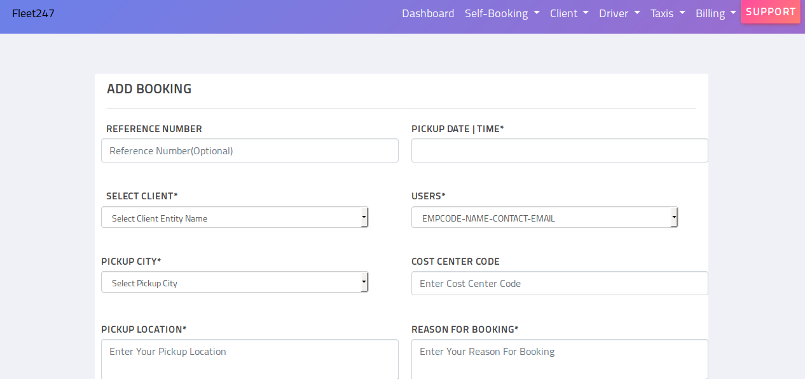

# Daily-Track-of-Fleet247
# Dated 6th Dec 2018
- [x] [Completed profile page](https://floating-plains-28292.herokuapp.com/profile.html)
- [x] [Change password page is not yet completed ](https://floating-plains-28292.herokuapp.com/changepassword.html)
- [x] Added profile item in the navbar.

# Dated 5th Dec 2018
- [x] [Completed add client ratespage](https://floating-plains-28292.herokuapp.com/addclientrates.html)
- [x] [Completed Add contact page ](https://floating-plains-28292.herokuapp.com/addclientcontact.html)
- [x] [Completed VIew Taxi page ](http://127.0.0.1:5500/viewvehicle.html)
- [x] [completed taxi details page](https://floating-plains-28292.herokuapp.com/taxitripdetails.html)
- [ ] I am working on unbilledinvoice page 
   ### Issues I am facing here
   * I am not able to increase the width of Pickup details column.
    ### Pages that are remaining in fleet247
   * The billing pages 
   * The main dashboard page
   
# Dated 3rd Dec 2018

### Issues I addressed 

- [x] Completed driver details page
 
# Dated 29th Nov 2018

[Demo of page](https://floating-plains-28292.herokuapp.com/)
### Issues I addressed 

- [ ] Worked on [view driver page](https://floating-plains-28292.herokuapp.com/viewdriver.html)
- [x] Made  Active button should be aligned in both cases when responsive property is true and false for datatables.  

## Dated 27th Nov 2018

[Demo of page](https://floating-plains-28292.herokuapp.com/)
### Issues I addressed 

- [x] Worked on [trip details page](https://floating-plains-28292.herokuapp.com/clientdetails.html) in order to make it responsive.
- [x] completed [client contact page](https://floating-plains-28292.herokuapp.com/clientcontact.html)
- [ ] working on [client rates page](https://floating-plains-28292.herokuapp.com/clientrates.html)

 #### Problems that I am facing in clent rates page
 * Active button should be aligned when it visible and when its not the same css rules cannot be applied for both the cases.
 * In view client page its not visible in laptop .So there was no such issue. 

## Dated 24th Nov 2018

[Demo of page](https://floating-plains-28292.herokuapp.com/)
### Issues I addressed 
- [x] Aligned the plus sign for cancelled bookings page .
* This was really challenging because same classes are being used in datatables.css and is applied for all pages.
I could come up with a solution but now the table  has a horizontal scroll :( .
- [x] changed all the styles for active button on view clients page so that it is aligned properly.
Finally I could do it :D

## Dated 21st Nov 2018
[Demo of page](https://floating-plains-28292.herokuapp.com/)
### Issues I addressed 
- [x] Completed archived assigned bookings page .
  * Completed reassign/add page
- [x] Changed layout in mobile to one column from 2 column.(There are still some alignment issues.Need to work on them)  
- [x] Linked all the forms in self-booking menu item  and deployed on herouko.
NOTE Cancelled Bookings Page is remaining.

## Dated 20th Nov 2018

[Demo of page](https://floating-plains-28292.herokuapp.com/)
### Issues I addressed 
- [x] Resized the select box so it does not go outside the container on reducing browser window width.
- [x] Added modals for add new taxi and add new driver (It was challenging to find out where I was wrong).
- [x] Linked all the forms with archived unassigned page and deployed on herouko.

## Dated 17th Nov 2018

[Demo of page](https://designer199.github.io/active-unassigned/)
### Issues I addressed 
- [x] Made the datatables reponsive (It was quite challenging just including responsivedatatables.js was not the solution as I thought it was).
- [ ] Tried to make the add form page responsive (Increasing the width of form container is not the solution as I thought )
- [ ] I am currently working on making the modal window.I had to remove the modal.html file because the site could not be previewed on gh-pages when I included the file (it shows on clicking the cancel button).

## Dated 14th Nov 2018
### Issues I addressed 
- [x]  Made the font size of menu bar little small.
- [x]  Integrated select2.js .The select.js is not visible for addtaxi page I can't figure out the reason.
- [ ]  Font is not uniform in forms . I am still working on this .Right now I can't figure out the reason.
- [ ]  I am currently working on datatables.In order to make it responsive.

## Dated 13th Nov 2018
[Deployed the site on herouko](https://floating-plains-28292.herokuapp.com/)
- [x] Changed logo for fleet247.
- [x] Deployed the site on herouko
- [x] Worked on browser compatibility issues for firefox

### Issues I addressed 
* Changed the dropdown arrow for all selectboxes for consistent view. After failed attempts with font awesome. I achieved it with help of a simple image.
* Removed dotted hover styles for select boxes and navbar.

 View before I addressed the issues for firefox the dotted hover styles are cannot be seen since it is an image. 
 
   

## Dated 12th Nov 2018

- [x] I integrated/linked all the forms.

- [x] Added dialog box.

- [x] Added form for support button.

- [ ] I m trying to deploy the static site on herouku (I am not able to push the changes).

Currently thesite can be viewed by cloning/downloading the repo.

## Dated : 9th Nov 2018
[Demo of self billing web page](https://designer199.github.io/self-billing-page/)
- [x] completed self billing page.
- [ ] Working on making a modal window for each form .

## Dated : 5th Nov 2018
[Demo of add driver web page](https://designer199.github.io/Add-Taxi-Details/)
- [x] Add Taxi page is reponsive/mobile-first.

[Demo of add driver web page](https://designer199.github.io/add-driver/)
- [x] Add driver page is reponsive/mobile-first

## Dated : 3rd Nov 2018
Incorporated following changes in add form page

- [x] Input boxes are not aligned properly.
- [x] Submit button should be at the bottom.
- [x] Integrated calendar for Pickup time. 
  #### Note :calender is integrated using jquery .I tried to find a date time picker for  bootstrap4 but its only avaliable in bootstrap 3.
 - [x] Completed Add Booking page (https://designer199.github.io/Add-Form-Page/)
- [x] Completed Add client page (https://designer199.github.io/add-client-form/)
- [ ] Half way through add driver page (https://designer199.github.io/add-driver/)

## Dated : 2st Nov 2018

- [x] Add form page is completed and responsive for mobile ,tablet and desktop.

## Things that I noticed

 - [ ] The original sass code threw a lot of errors when compiled into css and the page was not responsive. So I had to  write    new code in bootstrap 4 to make the form mobile-first/responsive.
 
 
 ## Dated : 1st Nov 2018

- [x] Counter section is completed and responsive for mobile ,tablet and desktop.
  
- [ ] I am currently working to make the add booking form responsive.

## Dated : 31 oct 2018

- [x] Navigation Bar is completed and responsive.

- [ ] I am currently working to make the add booking form responsive.

 ## Dated : 30 oct 2018
 ## Thoughts
 I am trying to find all the files used for the navigation bar in order to make the nav bar responsive.
 ## Problems that I am facing 
 Even after merging all the related files that I think are used in making the header/navigation the look of of the nav bar is not the same .The profile option is visible in my file but not in fleet247. The color/styles of support button is not chnged even after linking the button.scss in index.html
 
  ## Dated : 27 oct 2018
  ## Thoughts
  Add Booking form is not looking appealing as it should be.I need to work more on styling the elements and changing fonts.
  The inputs are coming out of form border in mobile view.
  
## Dated : 26 oct 2018
## Thoughts
I had to redo the navigation bar since  a lot of redundant rules were used . Styling the bootstrap navigation was challenging as I did it the first time using this approach
### Things to be done in nav bar
- [ ] the navbarbar should be closed automatically when user clicks on any link in menu/dropdown.This implemented but it is working for only the top most menu item. 
  
 
## Dated : 25 oct 2018

### Things to be done tommorow 

- [x] Try to find a different implemtation for the dropdown since person and its image is not accomdating  refer 
https://stackoverflow.com/questions/5449872/css-notlast-childafter-selector
 
 
